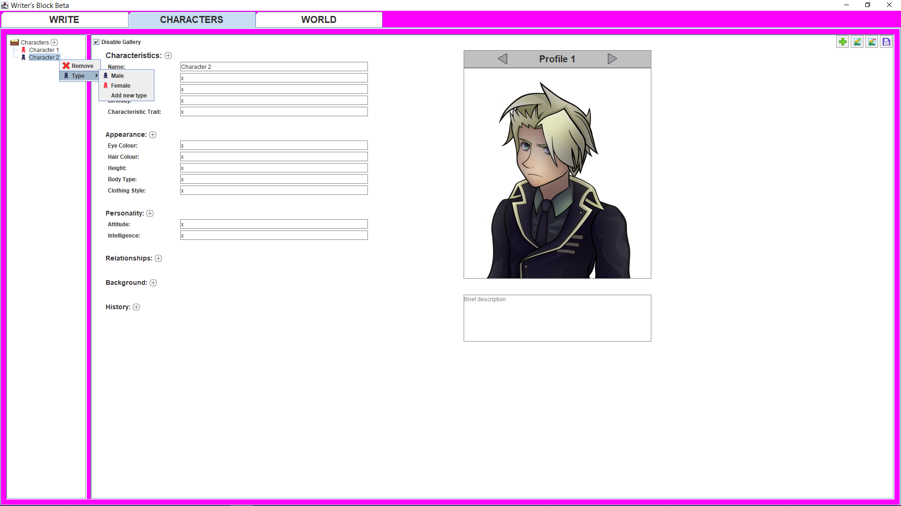
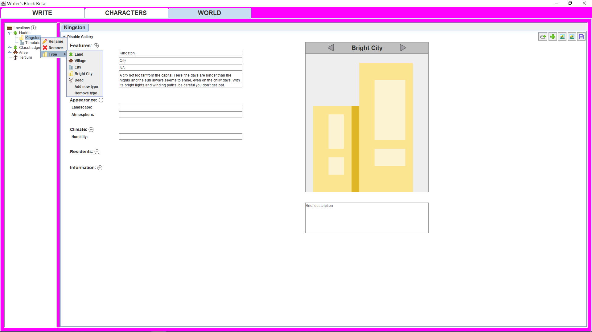
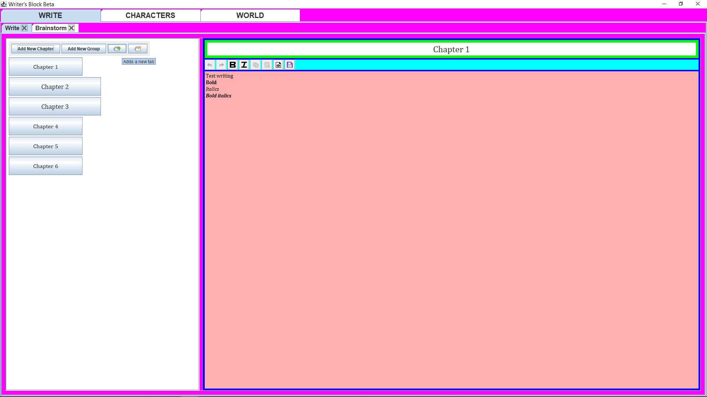

# WritersBlock

WritersBlock is a Java Swing UI story planner that saves data in JSON files. 

It can be used to create different elements of a story such as the characters and areas within a story, and there is an editor to write a story.

This project uses intellij for java/swing/maven.

running:
intellij - build, run Start.java
UI - this will have buttons to navigate to different pages to create characters and locations, and a page with a text editor to write a story.

### Development

This is in the middle of development so please expect some features will not be ready until further on when they are needed for my personal use.

